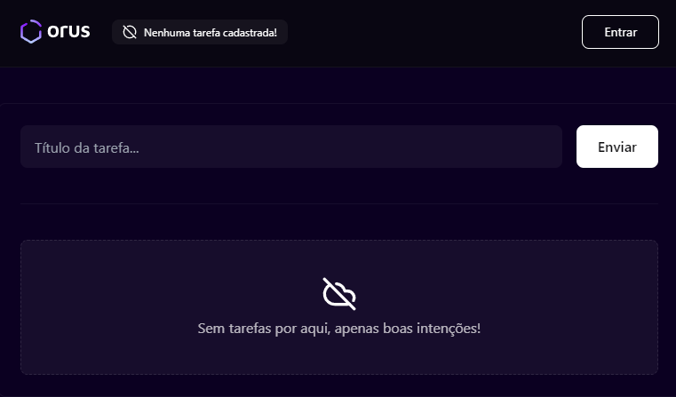

# Gerenciador de Estado (Similar ao Zustand)
Uma das formas de gerenciar Estados globais em aplicações React, é utilizar alguma biblioteca específica.
A escolha da ferramenta certa, garante que o projeto seja desenvolvido sem impactar no tamanho, na performance e principalmente na usabilidade.
Com isso em mente e olhando por baixo dos panos das principais bibliotecas do mercado como Zustand e Redux, criei esse projeto de caso de uso para demonstrar que podemos gerenciar estados globais sem o uso de uma dessas bibliotecas, criando algo simples, personalizado, sabendo o que está no código e principalmente, entendendo como é feito o gerenciamento de estados globais dentro do seu contexto.



## Caso de uso
A aplicação foi desenvolvida com uma página simples para listagem de tarefas cadastradas, contém um formulário para adicionar uma tarefa e um botão de login.
O objetivo principal é gerenciar de forma global, o estado de login e logout, mantendo a informação gerenciada e disponível por toda aplicação (caso fosse expandida para outras telas em rotas seguras).
Ao adicionar uma tarefa, a aplicação lista a mesma junto com as demais já cadastradas(se existir).
Possui as funcionalidades de marcar como concluída e excluir tarefas.

## Contexto
Criei esta PoC para exemplificar o gerenciamento do estado global do login, ao clicar no login, é feito a autenticação de forma simples e mocada, e então é mostrado o usuário logado.
No cenário real, se o usuário está logado e outras páginas necessitam obter informações do seu perfil, elas podem ser alimentadas através da `store` de usuário, onde a mesma é passada através de um `provider` que este é adicionado na tela inicial da aplicação, e seguindo o conceito de gerenciadores de estados globais, poderá obter os dados em qualquer área autenticada ou proposta para uso desses dados.

### 🛠 Tecnologias

- Tailwindcss
- Eslint - Linter.
- Prettier - Formatador de códigos, boas práticas de código limpo e organização.
- Husky - Utilitário de melhoramento para commits.
- Commitlint - Padronização de commits.
- Lint-stage - Utilitário para rodar o lint ao adicionar commit

## Como usar este projeto
Após clonar o repositório, entre na pasta `state-manager` e instale todas as dependências utilizando o o seu gerenciador de pacotes preferencial:
```bash
# Digite o comando abaixo para instalar as dependências:
npm install
```

Rode a aplicação:
```bash
npm run dev
```

### Autor
---

<div align="center">
<a href="https://www.linkedin.com/in/julianotavares/">
 
 <br />
 <sub><b>Juliano Tavares</b></sub></a> <a href="https://www.linkedin.com/in/julianotavares/" title="Juliano Tavares">🚀</a>

Feito com ❤️ por Juliano Tavares 👋🏽!
</div>
